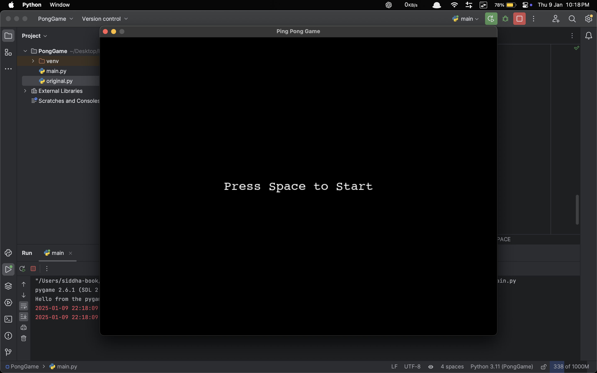
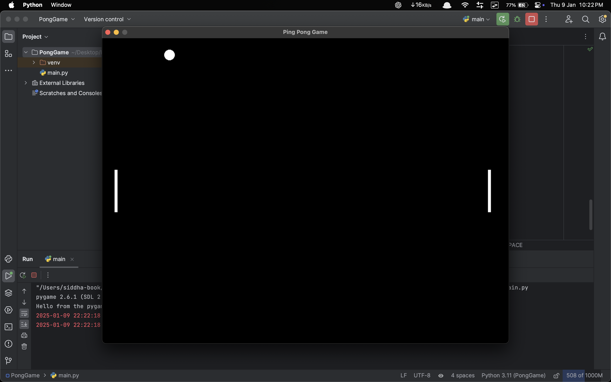

# Ping Pong Game

A simple Ping Pong game built using Python and Pygame. The game supports two players and features paddle movement, ball physics, and collision detection.

## Features
- Two-player mode with independent paddle controls.
- Realistic ball physics with paddle collision and boundary detection.
- Reset functionality when the ball goes out of bounds.
- Start screen with instructions.

## Controls
	•	Player 1:
	•	Move up: W
	•	Move down: S
	•	Player 2:
	•	Move up: Up Arrow
	•	Move down: Down Arrow
	•	Press Space to start the game.

## Requirements
	•	Python 3.7 or higher
	•	Pygame library

 ## Screenshots
 

 
